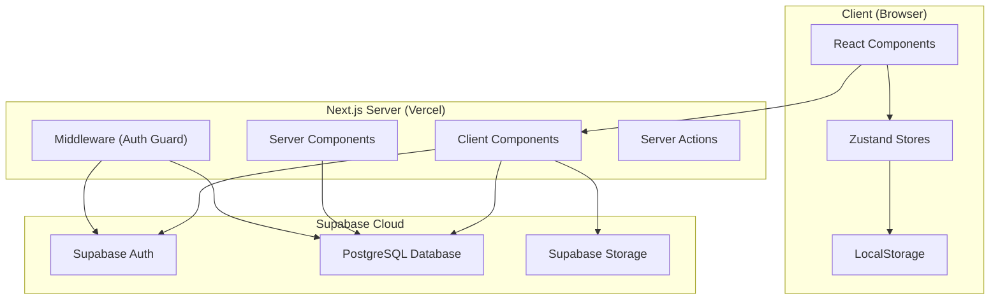
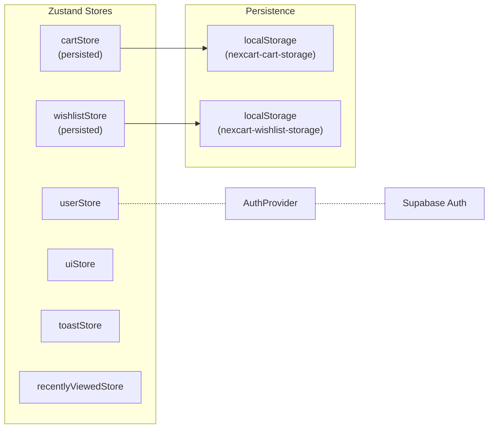
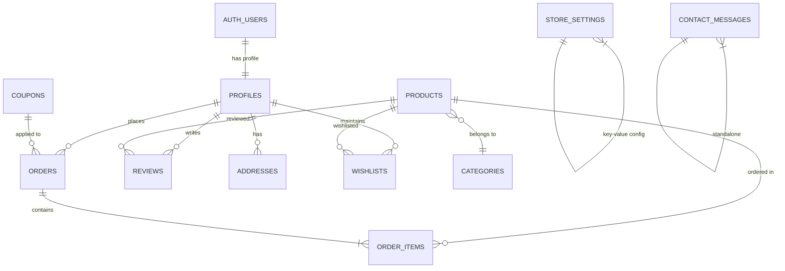
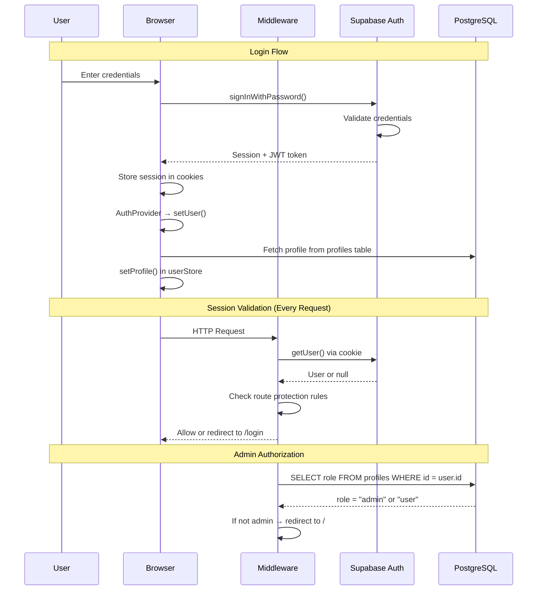
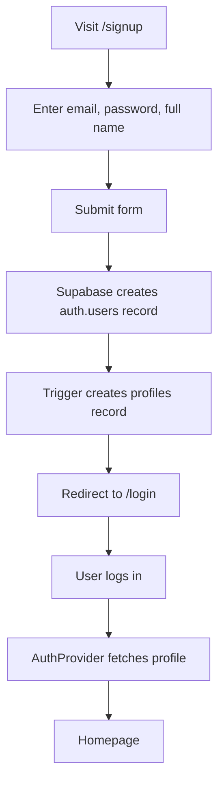
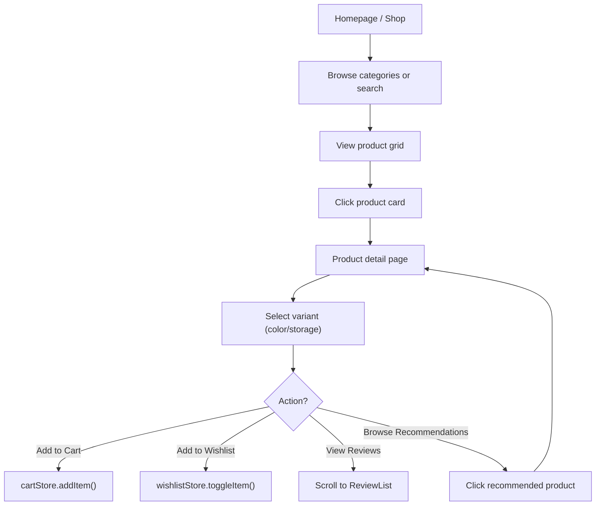
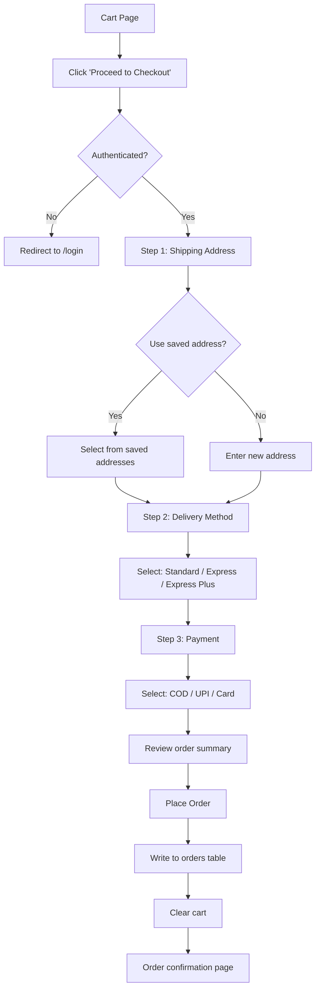
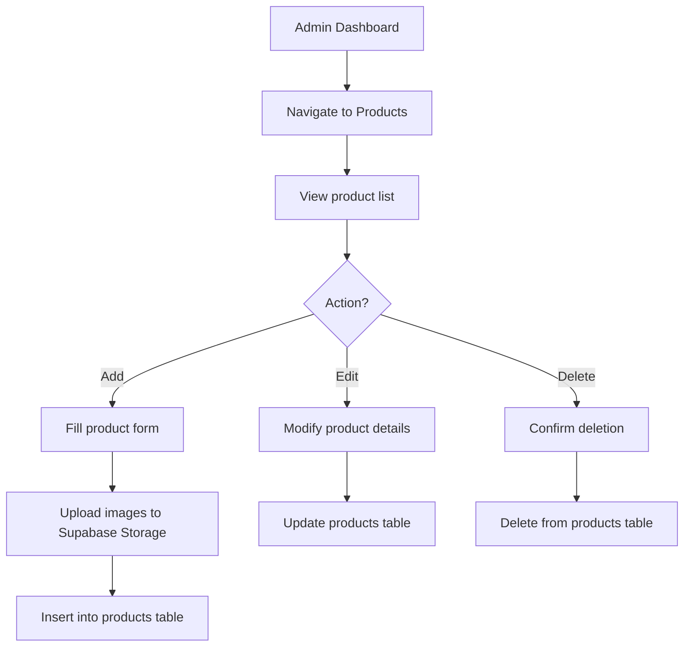
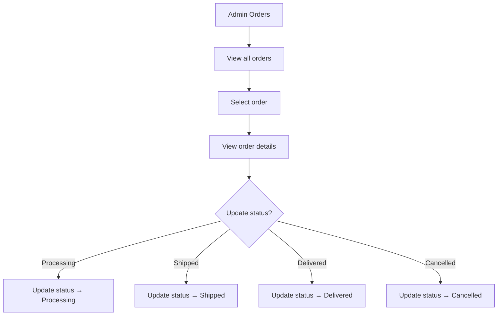

# NexCart — Complete Project Documentation

> **Platform**: NexCart Premium Electronics Store
> **Version**: 0.1.0
> **Last Updated**: March 11, 2026
> **Stack**: Next.js 16 · React 19 · Supabase · Zustand · Vercel

---

## Table of Contents

1. [Project Overview](#1-project-overview)
2. [Technology Stack](#2-technology-stack)
3. [System Architecture](#3-system-architecture)
4. [Database Architecture](#4-database-architecture)
5. [Pages and Routes](#5-pages-and-routes)
6. [Platform Features](#6-platform-features)
7. [Admin Dashboard](#7-admin-dashboard)
8. [Authentication & Authorization](#8-authentication--authorization)
9. [User Flow Diagrams](#9-user-flow-diagrams)
10. [Backend Logic](#10-backend-logic)
11. [Responsive Design](#11-responsive-design)
12. [Security](#12-security)
13. [Deployment & Infrastructure](#13-deployment--infrastructure)

---

## 1. Project Overview

**NexCart** is a full-stack, production-grade e-commerce platform specializing in premium electronics. It provides a complete online shopping experience including product browsing, variant selection, cart management, multi-step checkout, order tracking, wishlists, reviews, and a comprehensive admin dashboard.

### Key Highlights

| Aspect | Detail |
|---|---|
| **Product Domain** | Premium Electronics (Smartphones, Laptops, Audio, Watches, Accessories) |
| **Target Market** | India (INR currency, Indian states/cities in checkout) |
| **Design Language** | "Liquid Glass" — frosted glass panels, animated mesh backgrounds, emerald accents |
| **Architecture** | Server-rendered Next.js App Router with client-side Zustand state |
| **Database** | PostgreSQL via Supabase (hosted BaaS) |
| **Authentication** | Supabase Auth (Email/Password + Google OAuth) |
| **Deployment** | Vercel (Edge + Serverless) |

---

## 2. Technology Stack

### Frontend

| Technology | Version | Purpose |
|---|---|---|
| **Next.js** | 16.1.6 | React framework with App Router, SSR, Image Optimization, Turbopack |
| **React** | 19.2.3 | UI component library |
| **TypeScript** | 5.x | Type-safe JavaScript |
| **CSS Modules** | Built-in | Scoped, component-level styling (no Tailwind) |
| **Framer Motion** | 12.35.0 | Page animations, scroll-triggered reveals, transitions |
| **Lucide React** | 0.577.0 | Icon system (500+ consistent SVG icons) |
| **Inter** (Google Fonts) | — | Primary typeface with `display: swap` |

### Backend & Database

| Technology | Purpose |
|---|---|
| **Supabase** | Backend-as-a-Service (PostgreSQL, Auth, Storage, Real-time) |
| **@supabase/ssr** | Server-side Supabase client for Next.js (cookie-based auth) |
| **@supabase/supabase-js** | Browser-side Supabase client |
| **PostgreSQL** | Relational database (hosted by Supabase) |

### State Management

| Technology | Purpose |
|---|---|
| **Zustand** | Lightweight global state (6 stores) |
| **zustand/persist** | LocalStorage persistence for cart and wishlist |

### DevOps & Build

| Technology | Purpose |
|---|---|
| **Vercel** | Hosting, CI/CD, Edge Network, Preview Deployments |
| **Turbopack** | Next.js development bundler (faster than Webpack) |
| **ESLint** | Code quality and linting |
| **Git + GitHub** | Version control and collaboration |

### Why These Technologies?

- **Next.js 16** was chosen for its App Router architecture, enabling hybrid static/dynamic rendering, built-in image optimization, and Turbopack for fast development.
- **Supabase** provides a complete backend (auth, database, storage) without building custom APIs, reducing development time significantly.
- **Zustand** was selected over Redux for its minimal boilerplate—each store is a single file with no reducers, actions, or providers required.
- **CSS Modules** were chosen over Tailwind for maximum design control over the bespoke "liquid glass" aesthetic.
- **Framer Motion** powers the premium feel with scroll-triggered animations and smooth page transitions.

---

## 3. System Architecture

### High-Level Architecture



### Frontend Architecture

The frontend follows **Next.js App Router** conventions:

```
src/
├── app/                    # Route handlers (pages)
│   ├── layout.tsx          # Root layout (Navbar, Footer, AuthProvider)
│   ├── page.tsx            # Homepage
│   ├── globals.css         # Design system (CSS custom properties)
│   ├── admin/              # Admin panel (protected)
│   ├── user/               # User dashboard (protected)
│   ├── shop/               # Product browsing
│   ├── product/[id]/       # Dynamic product pages
│   ├── cart/               # Shopping cart
│   ├── checkout/           # Multi-step checkout
│   └── ...                 # Auth, support, and static pages
│
├── components/
│   ├── home/               # Homepage sections (BestSellers, BrandStrip, etc.)
│   ├── ecommerce/          # E-commerce UI (CartDrawer, ProductCard, etc.)
│   ├── layout/             # Navbar, Footer, MobileSlideDrawer
│   ├── providers/          # AuthProvider
│   ├── ui/                 # Primitives (GlassPanel, Button, Input, Toast)
│   └── seo/                # SEO components
│
├── store/                  # Zustand state stores
│   ├── cartStore.ts        # Cart items, quantities, coupons
│   ├── wishlistStore.ts    # Wishlist product IDs
│   ├── userStore.ts        # Auth user + profile
│   ├── uiStore.ts          # Cart drawer, mobile menu, filter sidebar
│   ├── toastStore.ts       # Toast notifications
│   └── recentlyViewedStore.ts  # Recently viewed products
│
├── lib/supabase/           # Supabase client configurations
│   ├── client.ts           # Browser client (singleton)
│   ├── server.ts           # Server client (cookie-based)
│   └── middleware.ts       # Session refresh + route protection
│
└── middleware.ts            # Next.js middleware entry point
```

### State Management Architecture



| Store | Persisted | Key State |
|---|---|---|
| `cartStore` | ✅ LocalStorage | Items, quantities, coupon, discount |
| `wishlistStore` | ✅ LocalStorage | Array of product IDs |
| `userStore` | ❌ Memory | Supabase User object + profile |
| `uiStore` | ❌ Memory | Cart drawer, mobile menu, filter sidebar toggles |
| `toastStore` | ❌ Memory | Toast notifications with auto-dismiss (3s) |
| `recentlyViewedStore` | ❌ Memory | Recently viewed product IDs |

---

## 4. Database Architecture

The application uses **Supabase PostgreSQL** with the following tables:

### Database Tables

| Table | Purpose | Key Columns |
|---|---|---|
| `profiles` | Extended user data | `id` (FK → auth.users), `full_name`, `email`, `avatar_url`, `role` (user/admin), `phone` |
| `products` | Product catalog | `id`, `name`, `description`, `price`, `sale_price`, `stock`, `category`, `brand`, `images[]`, `variants` (JSONB), `is_featured` |
| `categories` | Product categories | `id`, `name`, `slug`, `icon`, `description` |
| `orders` | Customer orders | `id`, `user_id` (FK → profiles), `items` (JSONB), `total`, `status`, `shipping_address` (JSONB), `shipping_method`, `payment_method` |
| `order_items` | Line items per order | `id`, `order_id` (FK → orders), `product_id`, `variant_id`, `quantity`, `price` |
| `reviews` | Product reviews | `id`, `product_id`, `user_id`, `rating`, `comment`, `status` (pending/approved/rejected) |
| `coupons` | Discount coupons | `id`, `code`, `discount_type` (percentage/fixed), `discount_value`, `min_cart_value`, `is_active`, `expires_at` |
| `addresses` | Saved user addresses | `id`, `user_id` (FK → profiles), `full_name`, `phone`, `address_line_1`, `city`, `state`, `pincode`, `is_default` |
| `store_settings` | Global store config | `id`, `key`, `value` (tax_rate, free_shipping_threshold) |
| `contact_messages` | Contact form submissions | `id`, `name`, `email`, `subject`, `message`, `status` |
| `wishlists` | Server-side wishlists | `id`, `user_id`, `product_id` |

### Entity Relationship Diagram



### Storage Buckets

| Bucket | Purpose |
|---|---|
| `product-images` | Product photos and generated images |
| `avatars` | User profile pictures |

---

## 5. Pages and Routes

### Public Pages

| Route | Purpose | Key Components |
|---|---|---|
| `/` | Homepage | Hero section, Categories grid, Deals banner, BestSellers, Product Spotlight, BrandStrip, WhyChooseUs |
| `/shop` | All products with filtering | ProductCard grid, price/category/stock filters, search |
| `/shop/categories` | Browse by category | Category cards with product counts |
| `/shop/category/[slug]` | Category-filtered products | Filtered ProductCard grid |
| `/product/[id]` | Product detail page | ProductGallery, VariantSelector, ReviewList, RecommendationsCarousel, RecentlyViewed |
| `/deals` | Active promotions | Coupon cards, discounted products |
| `/search` | Search results | Dynamic product search from query string |
| `/wishlist` | Public wishlist view | Wishlist items with add-to-cart |
| `/cart` | Shopping cart | Cart items, quantity controls, coupon input, order summary |
| `/about` | About the store | Company information, values |
| `/contact` | Contact form | Name, email, subject, message submission to Supabase |
| `/faq` | Frequently asked questions | Accordion FAQ items |
| `/help` | Help center | Support articles and links |
| `/track-order` | Order tracking | Order lookup by ID |
| `/policies/[slug]` | Legal pages | Privacy policy, terms, refund, shipping policies |

### Authentication Pages

| Route | Purpose |
|---|---|
| `/login` | Email/password + Google OAuth login |
| `/signup` | User registration |
| `/forgot-password` | Password reset request |
| `/reset-password` | Password reset form |
| `/auth/callback` | OAuth callback handler |

### Protected User Pages (`/user/*`)

| Route | Purpose |
|---|---|
| `/user` | User dashboard (profile overview, recent orders) |
| `/user/orders` | Order history with status |
| `/user/wishlist` | Saved wishlist items |
| `/user/addresses` | Manage saved addresses |
| `/user/settings` | Profile settings, password change |

### Protected Admin Pages (`/admin/*`)

| Route | Purpose |
|---|---|
| `/admin/dashboard` | Analytics overview (revenue, orders, customers) |
| `/admin/products` | CRUD product management |
| `/admin/orders` | Order management, status updates |
| `/admin/customers` | Customer list and details |
| `/admin/reviews` | Review moderation (approve/reject) |
| `/admin/messages` | Contact form message management |
| `/admin/settings` | Store settings (tax rate, free shipping threshold) |

### SEO Routes

| Route | Purpose |
|---|---|
| `/sitemap.xml` | Dynamic XML sitemap |
| `/robots.txt` | Robots.txt for crawlers |

### Protected Route: Checkout

| Route | Purpose |
|---|---|
| `/checkout` | 3-step checkout (Shipping → Delivery → Payment) |

---

## 6. Platform Features

### 6.1 Product Catalog System

- Full product database with name, description, price, sale price, stock, images, brand, and category
- Dynamic product pages with SSR for SEO
- Category-based browsing and filtering
- Full-text search across product names and descriptions

### 6.2 Product Variants

- JSONB-based variant system supporting **color**, **storage**, and **size** options
- Per-variant pricing — variants can have different prices than the base product
- Per-variant stock tracking
- Visual variant selector with color swatches and option pills

### 6.3 Product Media Gallery

- Multi-image product galleries
- Thumbnail navigation with active state
- Responsive image sizing via Next.js `<Image>` component
- Images served from Supabase Storage with CDN caching

### 6.4 Search Engine

- Navbar-integrated search bar
- Real-time search with debouncing
- Multi-field search (name, description, brand)
- Dedicated `/search` results page

### 6.5 Wishlist System

- Client-side wishlist via Zustand (persisted to LocalStorage)
- Toggle mechanism (add/remove with single click)
- Dedicated wishlist page with product details
- Heart icon toggle button on all product cards

### 6.6 Cart System

- Persistent cart via Zustand + LocalStorage
- Add/remove items with quantity controls
- Stock validation (cannot exceed available stock)
- Variant-aware cart (same product, different variant = separate line items)
- Slide-out cart drawer for quick access
- Coupon code application with server-side validation
- Automatic discount calculation

### 6.7 Checkout System

- **3-step wizard**: Shipping → Delivery → Payment
- **Saved addresses**: Select from previously saved addresses or enter new
- **Address management**: Save new addresses during checkout
- **Shipping options**: Standard (free), Express (₹199), Express Plus/Next-Day (₹499)
- **Dynamic tax calculation**: Tax rate fetched from store settings
- **Free shipping threshold**: Configurable via admin settings
- **Order summary**: Product images, variant details, itemized pricing
- **Order creation**: Writes to `orders` table with full JSONB line items

### 6.8 Order Tracking

- Order history with status badges (Pending, Processing, Shipped, Delivered, Cancelled)
- Order detail view with line items and shipping info
- Track order by order ID (public lookup)

### 6.9 Reviews & Ratings

- Star-based rating system (1–5)
- Written review comments
- Admin moderation workflow (pending → approved/rejected)
- Only approved reviews displayed on product pages

### 6.10 Recommendations & Recently Viewed

- "You May Also Like" carousel on product pages
- Category-based product recommendations
- Recently viewed products tracking (in-memory)

### 6.11 Deals & Coupons

- Admin-created coupon codes with percentage or fixed discounts
- Minimum cart value requirements
- Expiration date support
- Dedicated `/deals` page showcasing active coupons
- One-click coupon application from deals page to cart

### 6.12 Toast Notifications

- Global notification system via `toastStore`
- Success, error, and info variants
- Auto-dismiss after 3 seconds
- Stackable toast queue

---

## 7. Admin Dashboard

The admin panel is accessible only to users with `role: 'admin'` in the `profiles` table. It features a sidebar navigation on desktop and bottom tab navigation on mobile.

### 7.1 Dashboard (Analytics)

- Total revenue, total orders, total customers
- Revenue trends and order status breakdown
- Quick action cards

### 7.2 Product Management

- View all products in a searchable, sortable table
- Create new products with multi-image upload to Supabase Storage
- Edit product details (name, price, stock, description, category, variants)
- Delete products
- Image management with Supabase Storage integration

### 7.3 Order Management

- View all orders with status, customer, and total
- Update order status (Pending → Processing → Shipped → Delivered)
- View order details including line items and shipping info

### 7.4 Customer Management

- View all registered customers
- Customer profiles with order history
- Role management (user vs admin)

### 7.5 Review Moderation

- View all submitted reviews
- Approve or reject pending reviews
- Filter by status (pending, approved, rejected)

### 7.6 Message Management

- View contact form submissions
- Update message status (new, read, resolved)
- Reply or manage customer inquiries

### 7.7 Store Settings

- **Tax Rate**: Configurable percentage applied at checkout
- **Free Shipping Threshold**: Minimum cart value for free shipping

---

## 8. Authentication & Authorization

### Authentication Provider

**Supabase Auth** handles all authentication with two methods:

1. **Email/Password** — Standard signup and login
2. **Google OAuth** — Social login via Google

### Authentication Flow



### Session Management

| Aspect | Implementation |
|---|---|
| **Session Storage** | HTTP-only cookies (set by `@supabase/ssr`) |
| **Token Refresh** | Automatic via middleware on every request |
| **Persistence** | Survives browser refresh (cookie-based) |
| **Expiry** | Managed by Supabase (configurable, default 1 hour with refresh) |

### Authorization (Role-Based Access Control)

| Role | Permissions |
|---|---|
| **Guest** (unauthenticated) | Browse products, search, view deals, add to cart/wishlist |
| **Authenticated User** | All guest permissions + checkout, order history, profile, saved addresses, reviews |
| **Admin** | All user permissions + admin dashboard, product CRUD, order management, review moderation, store settings |

### Route Protection

```mermaid
flowchart TD
    REQ["Incoming Request"] --> MW["Middleware"]
    MW --> CHECK{"User authenticated?"}
    CHECK -->|No| PROTECT{"Protected route?"}
    PROTECT -->|"/user/*" or "/admin/*" or "/checkout"| REDIRECT1["Redirect → /login"]
    PROTECT -->|Public route| ALLOW1["Allow"]
    CHECK -->|Yes| ADMIN{"Route is /admin/*?"}
    ADMIN -->|Yes| ROLE{"Profile role = admin?"}
    ROLE -->|No| REDIRECT2["Redirect → /"]
    ROLE -->|Yes| ALLOW2["Allow"]
    ADMIN -->|No| ALLOW3["Allow"]
```

---

## 9. User Flow Diagrams

### 9.1 User Registration



### 9.2 Product Browsing



### 9.3 Checkout Flow



### 9.4 Admin Product Management



### 9.5 Admin Order Management



---

## 10. Backend Logic

### 10.1 No Custom API Routes

NexCart operates **without custom API routes**. All backend logic runs through:

1. **Supabase Client SDK** — Direct database queries from client components
2. **Supabase Server SDK** — Server-side queries in Server Components
3. **Middleware** — Session refresh and route protection

This "serverless" approach eliminates the need for a separate backend, as Supabase handles:
- Authentication (JWT issuance, validation, refresh)
- Database queries (with Row Level Security)
- File storage (with access policies)

### 10.2 Database Queries

All database operations use the **Supabase JavaScript Client**:

```typescript
// Browser-side (Client Components)
import { createClient } from '@/lib/supabase/client';
const supabase = createClient(); // Singleton
const { data, error } = await supabase.from('products').select('*');

// Server-side (Server Components)
import { createClient } from '@/lib/supabase/server';
const supabase = await createClient(); // Cookie-based
const { data } = await supabase.from('products').select('*');
```

### 10.3 State Synchronization

| Data Type | Source of Truth | Sync Mechanism |
|---|---|---|
| User session | Supabase Auth (cookies) | Middleware refreshes on every request |
| User profile | PostgreSQL `profiles` table | `AuthProvider` fetches on mount |
| Products | PostgreSQL `products` table | Fetched on page load (no cache) |
| Cart | Zustand + LocalStorage | Client-side only, synced to localStorage |
| Wishlist | Zustand + LocalStorage | Client-side only, synced to localStorage |
| Orders | PostgreSQL `orders` table | Written at checkout, read on dashboard |

### 10.4 Error Handling

- **Database errors**: Caught with try/catch, logged via `console.error`, user shown toast notification
- **Auth errors**: Displayed inline on login/signup forms
- **Network errors**: Graceful fallbacks with loading spinners and error states
- **Form validation**: Client-side validation before submission

---

## 11. Responsive Design

### Breakpoint Strategy

| Breakpoint | Target | Behavior |
|---|---|---|
| `> 1024px` | **Desktop** | Full sidebar layouts, multi-column grids, large hero sections |
| `769px – 1024px` | **Tablet** | Collapsed sidebars, 2-column grids, adjusted spacing |
| `≤ 768px` | **Mobile** | Single-column layouts, hamburger menu, bottom navigation |

### Key Responsive Behaviors

| Component | Desktop | Mobile |
|---|---|---|
| **Navbar** | Full horizontal menu + search bar | Hamburger icon → slide-out drawer |
| **Hero Section** | Side-by-side text + image | Stacked vertically with reduced font sizes |
| **Category Grid** | Horizontal scrolling cards | 2-column CSS Grid, 5th card centered |
| **Product Grid** | 3–4 column grid | 2-column grid with compact cards |
| **Product Spotlight** | Side-by-side content + image | Stacked: text → features → image → buttons (via CSS `order`) |
| **Checkout** | Wide form layout | Full-width single column |
| **Admin Panel** | Sidebar navigation | Bottom tab navigation |
| **User Dashboard** | Sidebar + content area | Stacked layout |
| **Cart Drawer** | 400px slide-in panel | Full-width overlay |
| **Buttons** | Inline button groups | Full-width stacked buttons |

### CSS Architecture

- **CSS Modules**: Every component has a co-located `.module.css` file
- **CSS Custom Properties**: Design tokens in `globals.css` (colors, shadows, radii, spacing)
- **Mobile-first approach with desktop overrides** via `@media (min-width: ...)` for critical layouts
- **Mobile-specific overrides** via `@media (max-width: 768px)` for fine-tuning

---

## 12. Security

### Authentication Security

| Measure | Implementation |
|---|---|
| **Password hashing** | Handled by Supabase Auth (bcrypt) |
| **JWT tokens** | Signed by Supabase, validated server-side |
| **Session cookies** | HTTP-only, secure, same-site strict (via `@supabase/ssr`) |
| **Token refresh** | Automatic on every request via middleware |
| **OAuth** | Google OAuth via Supabase (PKCE flow) |

### Authorization Security

| Measure | Implementation |
|---|---|
| **Route protection** | Middleware checks auth state before rendering protected routes |
| **RBAC** | Admin routes require `role: 'admin'` from profiles table |
| **Client-side guards** | User layout redirects to `/login` if no user in store |
| **Server-side guards** | Middleware queries `profiles.role` before allowing `/admin/*` |

### Data Security

| Measure | Implementation |
|---|---|
| **Environment variables** | Supabase URL and anon key stored in `.env.local` (not committed) |
| **Input validation** | Form validation on client before database writes |
| **SQL injection prevention** | Supabase client uses parameterized queries (no raw SQL) |
| **XSS prevention** | React's default JSX escaping + no `dangerouslySetInnerHTML` |
| **CORS** | Managed by Supabase project settings |

### Content Security

| Measure | Implementation |
|---|---|
| **Image optimization** | All images served through Next.js `<Image>` (resized, formatted) |
| **Preconnect hints** | `<link rel="preconnect">` to Supabase domain |
| **DNS prefetch** | `<link rel="dns-prefetch">` for Supabase domain |

---

## 13. Deployment & Infrastructure

### Deployment Platform: Vercel

| Aspect | Detail |
|---|---|
| **Platform** | Vercel (Hobby/Pro plan) |
| **Region** | Auto-detected (Edge Network) |
| **Build System** | Turbopack (development), Next.js build (production) |
| **CI/CD** | Auto-deploy on `git push` to `main` branch |
| **Preview Deployments** | Generated for every pull request |
| **Domain** | Custom domain configurable via Vercel Dashboard |

### Build Process

```bash
npm run build          # next build (production)
npm run dev            # next dev (development with Turbopack)
npm start              # next start (production server)
```

### Environment Variables

| Variable | Purpose |
|---|---|
| `NEXT_PUBLIC_SUPABASE_URL` | Supabase project API URL |
| `NEXT_PUBLIC_SUPABASE_ANON_KEY` | Supabase publishable (anon) key |
| `NEXT_PUBLIC_SITE_URL` | Site URL for SEO metadata |

### Supabase Services Used

| Service | Purpose |
|---|---|
| **Authentication** | User signup, login, password reset, Google OAuth |
| **Database** | PostgreSQL for all application data |
| **Storage** | Product images, user avatars |
| **Row Level Security** | Database-level access control policies |

### SEO Infrastructure

| Feature | Implementation |
|---|---|
| **Dynamic Sitemap** | `/sitemap.xml` generated from product and category data |
| **Robots.txt** | `/robots.txt` with crawl directives |
| **Meta Tags** | OpenGraph and Twitter cards on every page |
| **Structured Metadata** | `metadata` export in layout and page files |
| **Semantic HTML** | Proper heading hierarchy, semantic elements |

---

> **Document End**
>
> This documentation covers the complete NexCart e-commerce platform architecture, code structure, database design, features, security model, and deployment setup. It is suitable for technical handoffs, client presentations, and ongoing maintenance reference.
